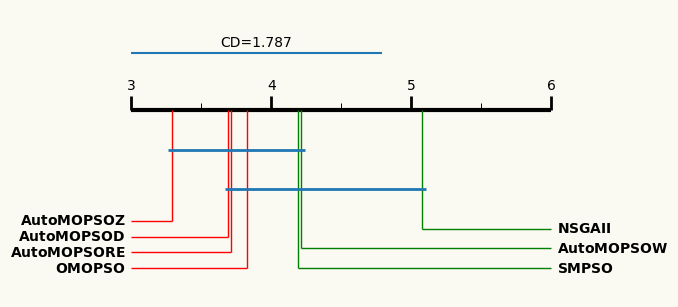

Example Critical Distance Diagram
=================================

Single Critical Distance 
------------------------

The last feauture of the library is the ability to generate critical distance diagrams of the results of the experiments. The following code snippet demonstrates how to generate a critical distance diagram of the results of the experiments for a selected metric:

.. code-block:: python

    import pandas as pd
    from SAES.plots.critical_distance_plot import CDplot_csv_metrics

    # Load the data and metrics from the CSV files
    data = pd.read_csv('data.csv')
    metrics = pd.read_csv('metrics.csv')

    # Choose the metric to generate the boxplot
    metric = 'NHV'

    CDplot_csv_metrics(data, metric, metric)

or

.. code-block:: python

    from SAES.plots.critical_distance_plot import CDplot_csv_metrics

    # Path to the CSV file containing the benchmarking data.
    data = 'data.csv'
    metrics = 'metrics.csv'

    # Choose the metric to generate the boxplot
    metric = 'NHV'
    
    CDplot_csv_metrics(data, metric, metric)

The above code snippet generates a critical distance diagram for the experimental results of all problems based on the selected metric "NHV." The critical distance diagram is saved as a PNG file in the current working directory, and it will look similar to this:

Single Critical Distance generation
-----------------------------------

If you prefer the library to generate all the critical distance diagrams for all the metrics in the data, you can use the following code snippet:

.. code-block:: python

    import pandas as pd
    from SAES.plots.critical_distance_plot import CDplot_csv

    # Load the data and metrics from the CSV files
    data = pd.read_csv('data.csv')
    metrics = pd.read_csv('metrics.csv')

    CDplot_csv(data, metric, metric)

or

.. code-block:: python

    from SAES.plots.critical_distance_plot import CDplot_csv

    # Path to the CSV file containing the benchmarking data.
    data = 'data.csv'
    metrics = 'metrics.csv'
    
    CDplot_csv(data, metric, metric)

The diagrams are saved as PNG files in the current working directory in a folder called "critical_distance". For each different metric, all its diagrams will be saved in a subfolder with the name of the metric.