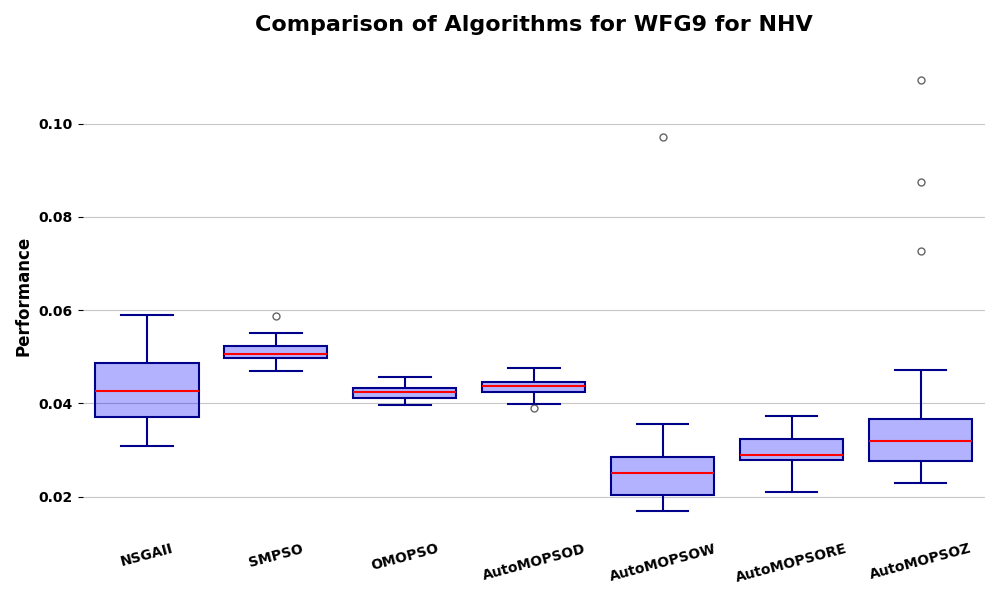

Example boxplot
===============

.. contents:: Table of Contents
   :depth: 2
   :local:

Single Boxplot 
--------------

The first feauture of the library is the ability to generate boxplots of the results of the experiments. The following code snippet demonstrates how to generate a boxplot of the results of the experiments:

.. code-block:: python

    import pandas as pd
    from SAES.plots import create_boxplot_for_problem

    # Load the data from the CSV file
    data = pd.read_csv('data.csv')
    
    create_boxplot_for_problem(data, "ProblemA", "MetricX")

or 

.. code-block:: python

    from SAES.plots import create_boxplot_for_problem

    # Path to the CSV file containing the benchmarking data.
    data = "data.csv"
    
    create_boxplot_for_problem(data, "ProblemA", "MetricX")

The above code snippet generates a boxplot of the results of the experiments for the problem "ProblemA" and the metric "MetricX". The boxplot is saved as a PNG file in the current working directory and it will looks something like this:

Full Boxplot generation
-----------------------

If you prefer the library to generate all the boxplots for all the problems and metrics in the data, you can use the following code snippet:

.. code-block:: python

    import pandas as pd
    from SAES.plots import generate_boxplots_from_csv

    # Load the data from the CSV file
    data = pd.read_csv('data.csv')

    # Load the metrics from the CSV file
    metrics = pd.read_csv('metrics.csv')
    
    generate_boxplots_from_csv(data, metrics)

or

.. code-block:: python

    from SAES.plots import generate_boxplots_from_csv

    # Path to the CSV file containing the benchmarking data.
    data = "data.csv"
    metrics = "metrics.csv"
    
    generate_boxplots_from_csv(data, metrics)

The boxplots are saved as PNG files in the current working directory in a folder called "boxplots". For each different metric, all its boxplots will be saved in a subfolder with the name of the metric.